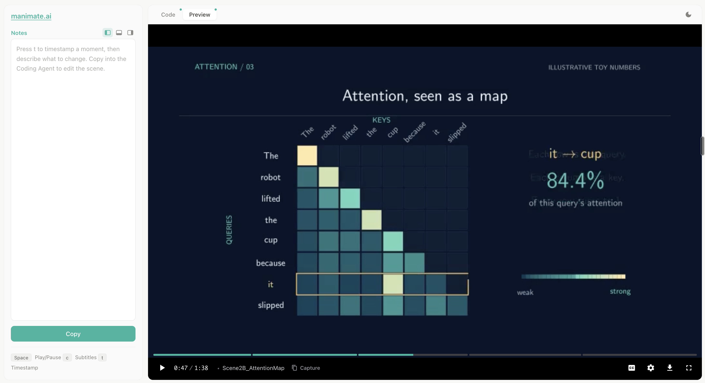

# Manim Skill

**Create videos like you write code, with your coding agent**

Works with Claude Code and Codex. Your coding agent autonomously generates
3Blue1Brown-style videos following a structured workflow: Narration → TTS → Code →
Render → Mux → View. Voiceover narration and time-synced subtitles are on by
default.


## Installation

```bash
git clone https://github.com/Yusuke710/manim-skill
cd manim-skill

# System libraries (macOS)
brew install cairo pkg-config ffmpeg
brew install --cask mactex-no-gui   # LaTeX — required for Tex/MathTex text rendering

# Python packages — Manim + local Kokoro voiceover(no API key needed), from pyproject.toml
uv sync

# Register the skill (symlink it into each agent's skills dir)
ln -s "$PWD/skills/manim-skill" ~/.claude/skills/manim-skill   # Claude Code
ln -s "$PWD/skills/manim-skill" ~/.codex/skills/manim-skill    # Codex
# Alternatively, ask your coding agent to add this skill
```

## How it works

Describe the video to your coding agent. It chooses the scene structure directly
in the animation code, without creating a separate plan document.

1. **Generate** - The agent writes spoken lines to `narration.txt`, generates
   local Kokoro TTS, writes Manim code using measured narration timing, checks
   subtitles, renders, and muxes until `video.mp4` exists. Silent videos skip
   narration and go straight to code and rendering.
2. **Iterate** - Claude opens a video viewer in your browser. Add feedback,
   copy it into Claude Code, and Claude refines the video based on your notes.
   The same workflow works with Codex.

   

   Watch the video and pause at a moment you want to discuss. Click **Capture**
   or press **t** to add the current timestamp and scene name to **Notes**.
   Describe what to fix in that frame, request a change, or ask a question—for
   example, "These labels overlap; move them apart" or "Why does this token
   attend most strongly to cup?" Repeat for any other moments.

   Click **Copy**, paste the notes into Claude Code (or Codex), and send them.
   The agent can inspect the referenced frames, answer your questions, and
   update the affected scenes. Reload the viewer to watch the revised video
   and repeat as needed.

## Local voiceover with Kokoro TTS

Narration uses [Kokoro TTS](https://github.com/hexgrad/kokoro), an open-weight
text-to-speech model that runs locally without an API key. `uv sync` installs
the Python dependencies.

## Where files go

Every video is a flat session folder under one consistent home — **never** in
your working directory:

```
~/.manim-skill/<project-slug>/    # narration.txt, script.py, video.mp4, media/, ...
```

Override the home with `MANIM_SKILL_HOME`. This means you can point the skill at
your own codebase ("visualize this algorithm") without it leaving artifacts
behind — it reads your files in place and writes only into the session folder.

## License

MIT License - see [LICENSE](LICENSE) file for details.
