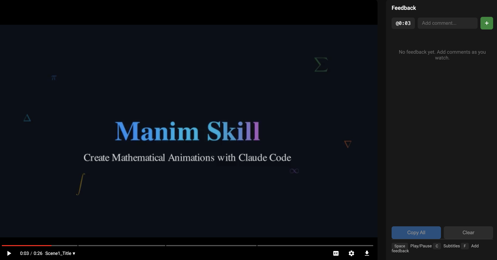

# Video Viewer

Browser-based viewer for Manim animations with chapter navigation and feedback collection for rapid iterative development with claude code.



## Usage

```bash
python3 video_viewer.py <video.mp4> --order <concat.txt> [--script <script.py>]
```

**Options:**
- `--order` - Video order file (required, same as ffmpeg concat.txt)
- `--script` - Manim script (optional, enables HQ re-render on download)
- `--port` - Server port (default: auto)

Subtitles are auto-generated by concatenating `.srt` files next to each scene video.

**Output:** Prints `VIDEO_READY http://localhost:<port>` when server is ready.

## Shortcuts

| Key | Action |
|-----|--------|
| `Space` / `K` | Play/Pause |
| `←` / `J` | Back 5s |
| `→` / `L` | Forward 5s |
| `C` | Toggle subtitles |
| `F` | Focus feedback input |

## Requirements

- Python 3.10+
- ffmpeg/ffprobe
